# AWS Automation with Lambda & Boto3

A collection of AWS Lambda functions (Python/Boto3) that automate common cloud operations including resource cleanup, backup management, auto-tagging, security auditing, and cost monitoring.

## Assignments Overview

| # | Lambda Function | Description |
|---|----------------|-------------|
| 1 | [S3 Bucket Cleanup](#assignment-1-automated-s3-bucket-cleanup) | Deletes S3 objects older than a configurable threshold (default: 30 days) |
| 2 | [EBS Snapshot Manager](#assignment-2-automated-ebs-snapshot-creation-and-cleanup) | Creates automated EBS snapshots and cleans up old snapshots on a weekly schedule |
| 3 | [EC2 Auto-Tagger](#assignment-3-auto-tagging-ec2-instances-on-launch) | Automatically tags new EC2 instances on launch via EventBridge |
| 4 | [Cost Monitor & Alerter](#assignment-4-daily-aws-cost-alert-using-cost-explorer-api-and-sns) | Queries month-to-date AWS spend and sends SNS alerts when threshold is exceeded |
| 5 | [Snapshot Restore & Launch](#assignment-5-snapshot-restore--instance-launch) | Restores an EC2 instance from the latest EBS snapshot |
| 6 | [S3 Public Access Auditor](#assignment-6-s3-public-access-auditor) | Audits all S3 buckets for public access and alerts via SNS |

## Repository Structure

```
.
├── lambda_trust_policy.json          # IAM trust policy for Lambda execution role
├── assignment-1/
│   ├── lambda_function.py            # S3 old object cleanup
│   └── iam_policy.json
├── assignment-2/
│   ├── lambda_function.py            # EBS snapshot create & rotate
│   ├── iam_policy.json
│   └── eventbridge_rule.json         # Cron schedule (Sundays 2AM UTC)
├── assignment-3/
│   ├── lambda_function.py            # EC2 auto-tagger
│   ├── iam_policy.json
│   └── eventbridge_pattern.json      # EC2 state-change event pattern
├── assignment-4/
│   ├── lambda_function.py            # Cost monitor with SNS alerts
│   └── iam_policy.json
├── assignment-5/
│   ├── lambda_function.py            # Snapshot restore & instance launch
│   └── iam_policy.json
├── assignment-6/
│   ├── lambda_function.py            # S3 public access auditor
│   └── iam_policy.json
└── screenshots/                      # AWS Console screenshots for each assignment
```

---

## Assignment 1: Automated S3 Bucket Cleanup

**Objective:** Automate deletion of stale objects in an S3 bucket — delete files older than 30 days.

### Architecture Diagram

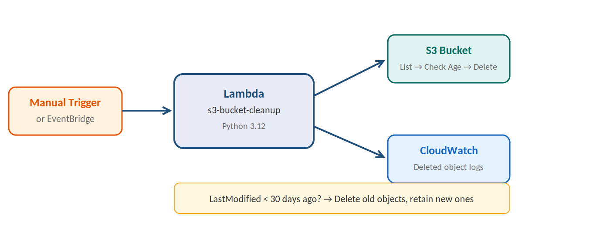

### Phase 1: Create the S3 Bucket and Upload Test Files

**Step 1.1 — Open S3**

Log in to AWS Console → search for S3 → click S3

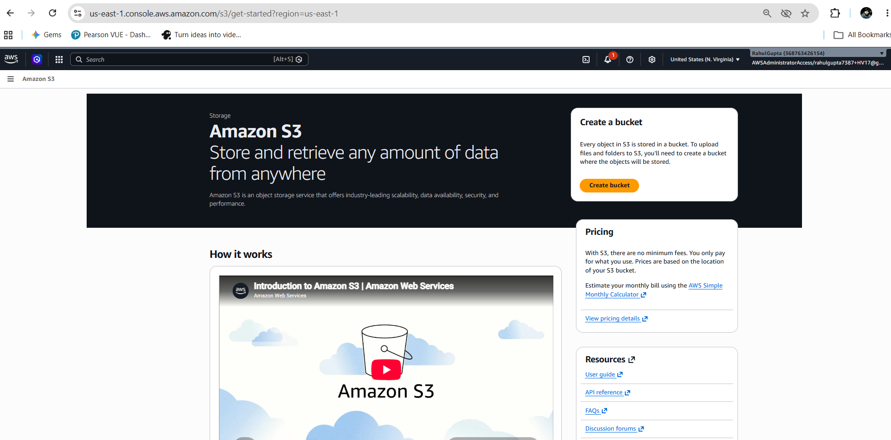

**Step 1.2 — Create a bucket**

Click **Create bucket** → Bucket name: `my-cleanup-demo-bucket-rahul`

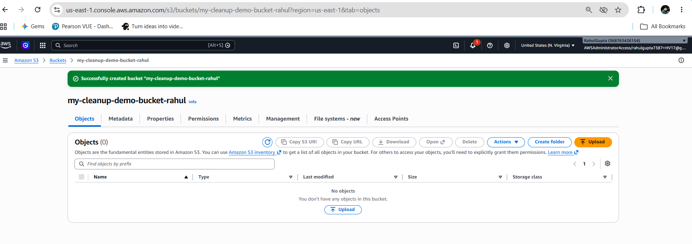

**Step 1.3 — Upload test files**

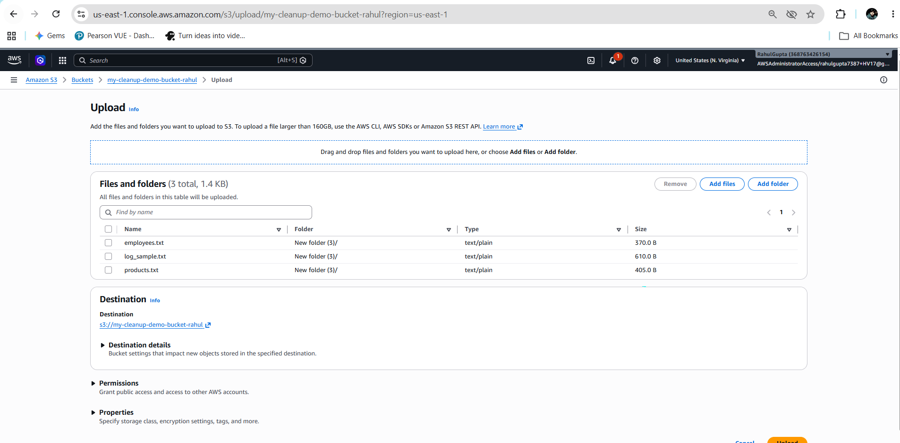
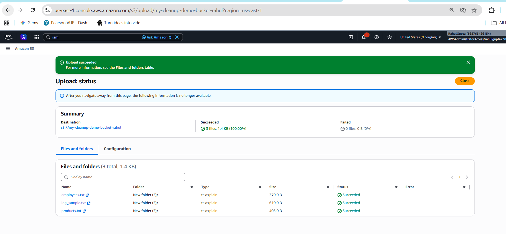

### Phase 2: Create the IAM Role with Least-Privilege Policy

**Step 2.1 — Open IAM**

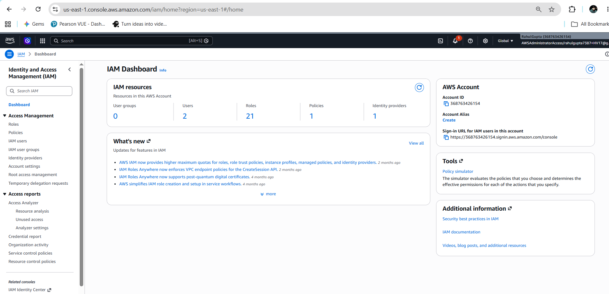

**Step 2.2 — Create a role**

Left sidebar: **Roles** → **Create role**
- Trusted entity type: AWS service
- Use case: Lambda
- Role name: `lambda-s3-cleanup-role`

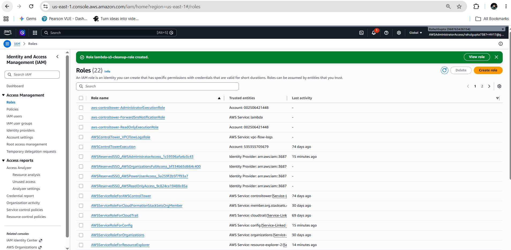

Click into the role → **Permissions** tab → **Add permissions** → **Create inline policy** → **JSON** tab

Policy name: `s3-cleanup-policy`

```json
{
  "Version": "2012-10-17",
  "Statement": [
    {
      "Sid": "S3CleanupAccess",
      "Effect": "Allow",
      "Action": ["s3:ListBucket"],
      "Resource": "arn:aws:s3:::my-cleanup-demo-bucket-rahul"
    },
    {
      "Sid": "S3DeleteObjects",
      "Effect": "Allow",
      "Action": ["s3:DeleteObject"],
      "Resource": "arn:aws:s3:::my-cleanup-demo-bucket-rahul/*"
    },
    {
      "Sid": "CloudWatchLogs",
      "Effect": "Allow",
      "Action": [
        "logs:CreateLogGroup",
        "logs:CreateLogStream",
        "logs:PutLogEvents"
      ],
      "Resource": "arn:aws:logs:*:*:*"
    }
  ]
}
```

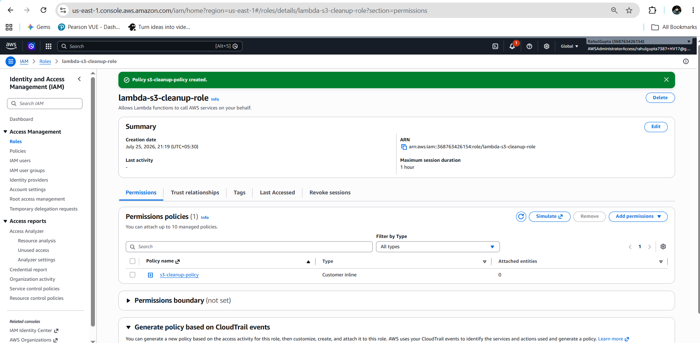

### Phase 3: Create the Lambda Function

Open **Lambda** → **Create function**
- Function name: `s3-bucket-cleanup`
- Runtime: Python 3.12
- Architecture: x86_64
- Execution role: **Use an existing role** → `lambda-s3-cleanup-role`

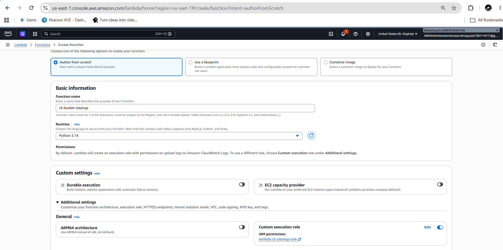
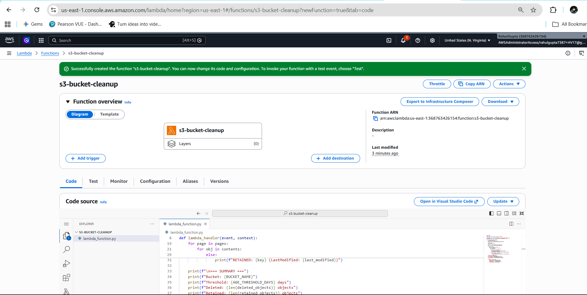

In the **Code** tab, paste the function code from [`assignment-1/lambda_function.py`](assignment-1/lambda_function.py), then click **Deploy**.

**Add environment variables** — Configuration tab → Environment variables → Edit:
| Key | Value |
|-----|-------|
| `BUCKET_NAME` | `my-cleanup-demo-bucket-rahul` |
| `AGE_THRESHOLD_DAYS` | `0` (for testing — makes ALL files eligible) |

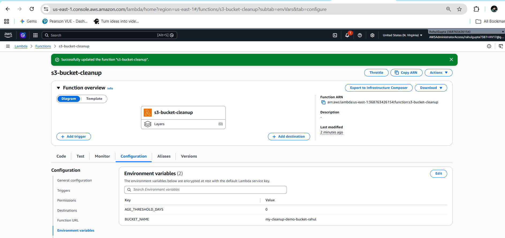

**Increase timeout** — Configuration → General configuration → Edit → Timeout: **1 min 0 sec**

### Phase 4: Test the Function

Go to **Test** tab → Event name: `TestCleanup` → Event JSON: `{}` → Click **Test**

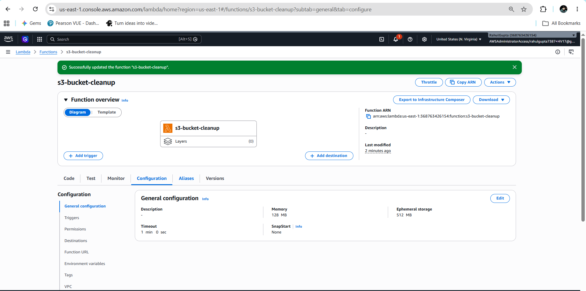

Green **Execution result: succeeded** banner:

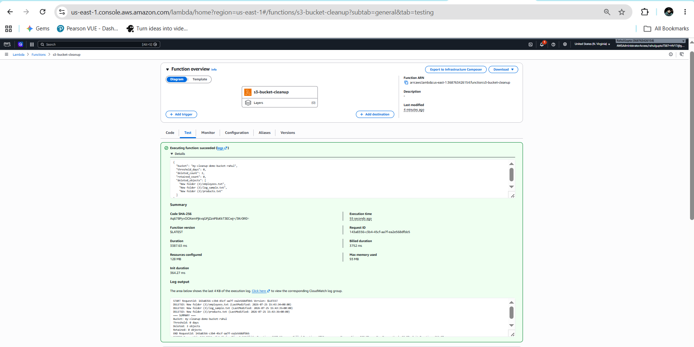

**Verify in S3** — Confirm the files are deleted:

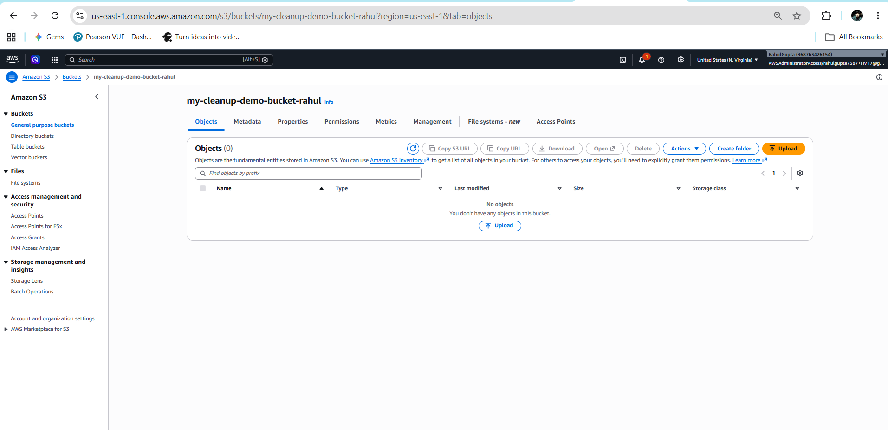

**Check CloudWatch Logs** — CloudWatch → Log groups → `/aws/lambda/s3-bucket-cleanup`:

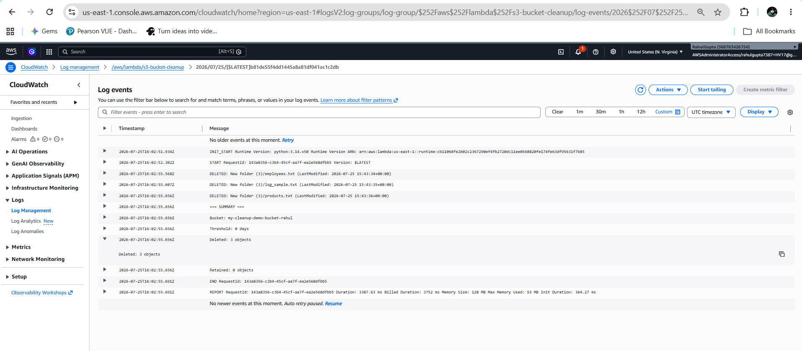

### Phase 5: Set Production Value

Change `AGE_THRESHOLD_DAYS` back to `30`:

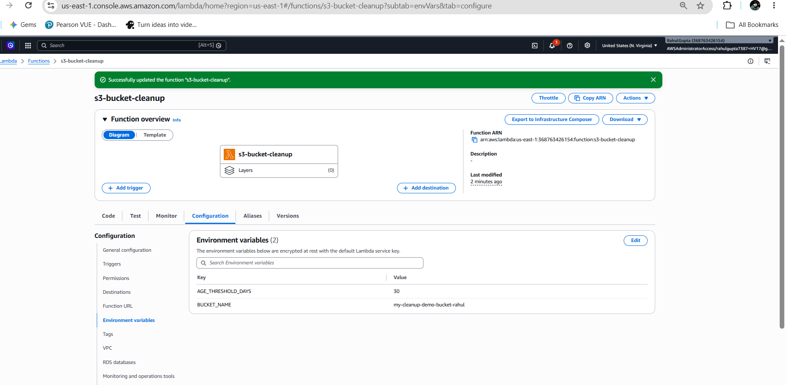

### Discussion

> In production, **S3 Lifecycle Rules** handle age-based object deletion natively with zero code. Lambda is the better choice when you need conditional logic beyond simple age (e.g., delete only files matching a pattern like `*.tmp`), when deletion must trigger cross-service actions (logging to DynamoDB, sending SNS notifications), or when business logic from external systems determines which objects to keep.

---

## Assignment 2: Automated EBS Snapshot Creation and Cleanup

**Objective:** Automate EBS volume backups and delete snapshots older than a retention period.

### Architecture Diagram

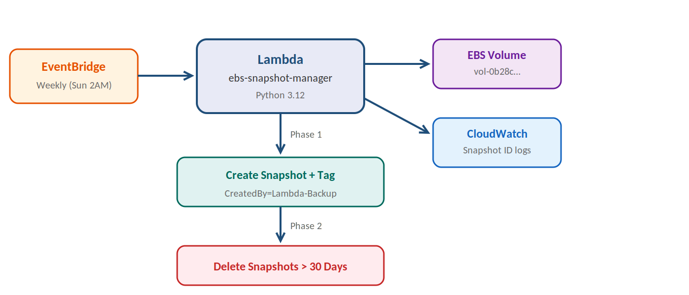

### Phase 1: Create an EBS Volume

**Step 1.1 — Open EC2**

AWS Console → search EC2 → click EC2

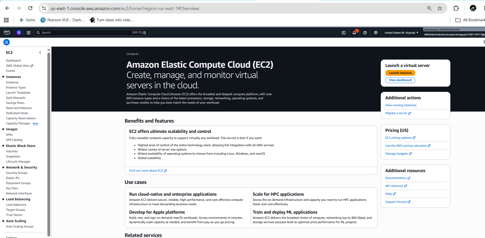

**Step 1.2 — Create an EBS volume**

Left sidebar: **Elastic Block Store** → **Volumes** → **Create volume**
- Volume type: gp3
- Size: 8 GiB
- Volume ID: `vol-0b28c036a11912ffc`

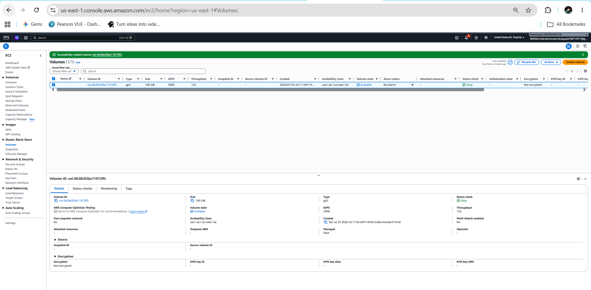

### Phase 2: Create the IAM Role

**Step 2.1 — Create the role**

IAM → Roles → Create role → Trusted entity: AWS service → Lambda → Role name: `lambda-ebs-backup-role`

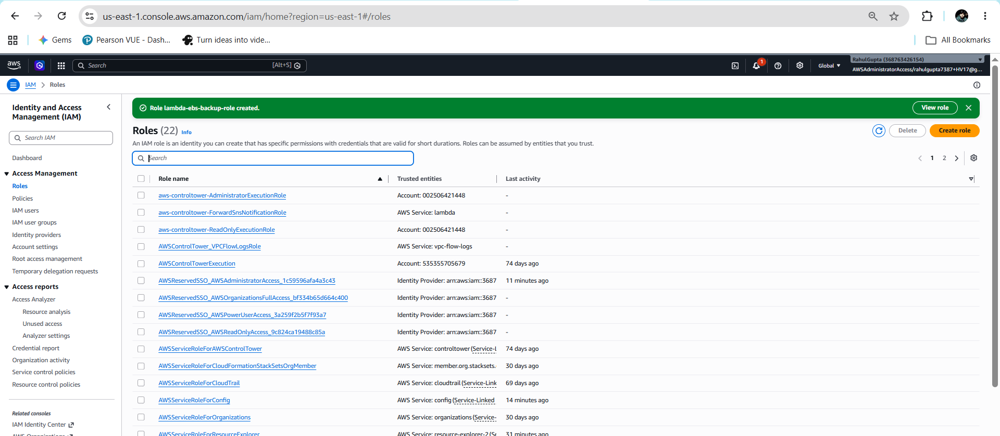

**Step 2.2 — Add inline policy**

Policy name: `ebs-backup-policy`

```json
{
  "Version": "2012-10-17",
  "Statement": [
    {
      "Sid": "EBSSnapshotManagement",
      "Effect": "Allow",
      "Action": [
        "ec2:CreateSnapshot",
        "ec2:DescribeSnapshots",
        "ec2:DeleteSnapshot",
        "ec2:CreateTags"
      ],
      "Resource": "*"
    },
    {
      "Sid": "CloudWatchLogs",
      "Effect": "Allow",
      "Action": [
        "logs:CreateLogGroup",
        "logs:CreateLogStream",
        "logs:PutLogEvents"
      ],
      "Resource": "arn:aws:logs:*:*:*"
    }
  ]
}
```

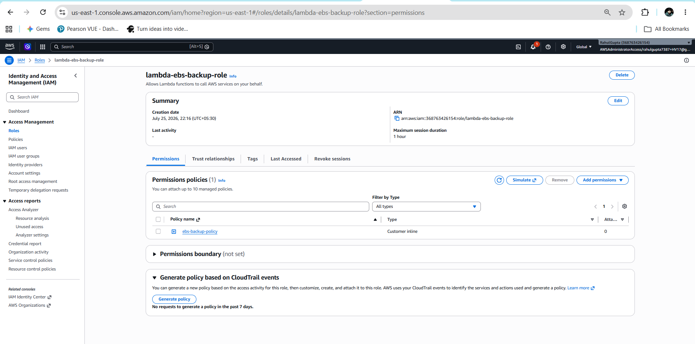

### Phase 3: Create the Lambda Function

Lambda → Create function
- Function name: `ebs-snapshot-manager`
- Runtime: Python 3.14
- Execution role: `lambda-ebs-backup-role`

Paste the code from [`assignment-2/lambda_function.py`](assignment-2/lambda_function.py).

**Add environment variables:**

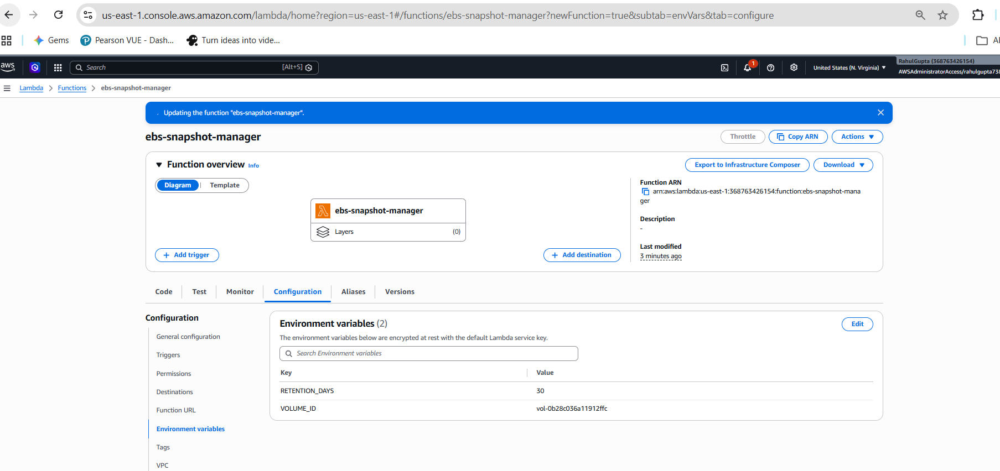

**Increase timeout:**

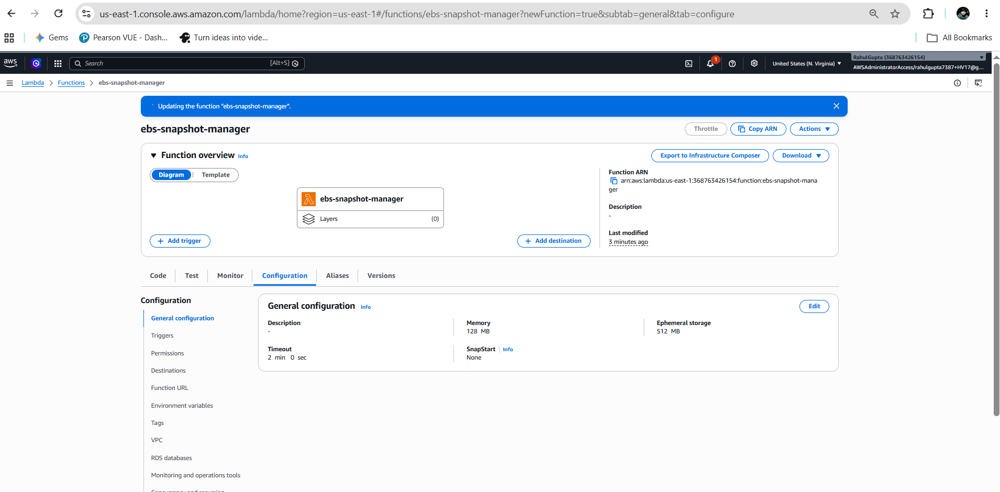

### Phase 4: Test the Function

Click **Test** → Green **Execution result: succeeded**:

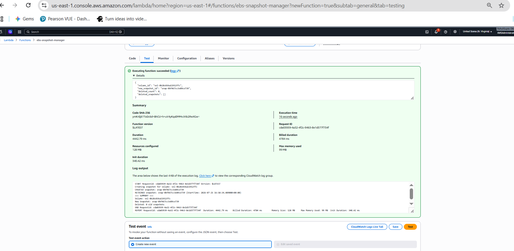

**Verify the snapshot in EC2** — EC2 → Elastic Block Store → Snapshots:

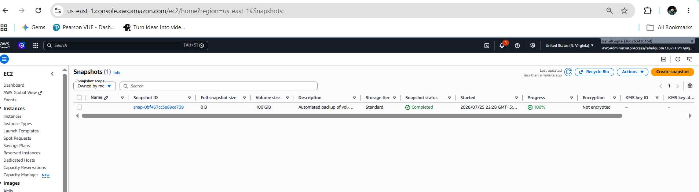
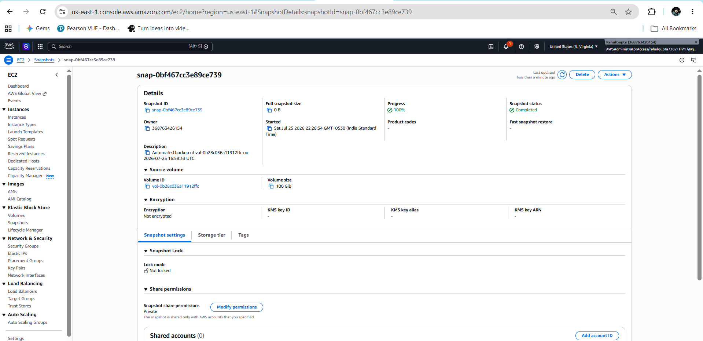

**Check CloudWatch Logs:**

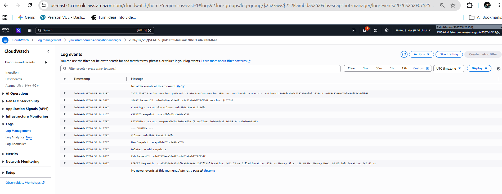

### Phase 5: Create the EventBridge Weekly Schedule

Amazon EventBridge → **Create rule**

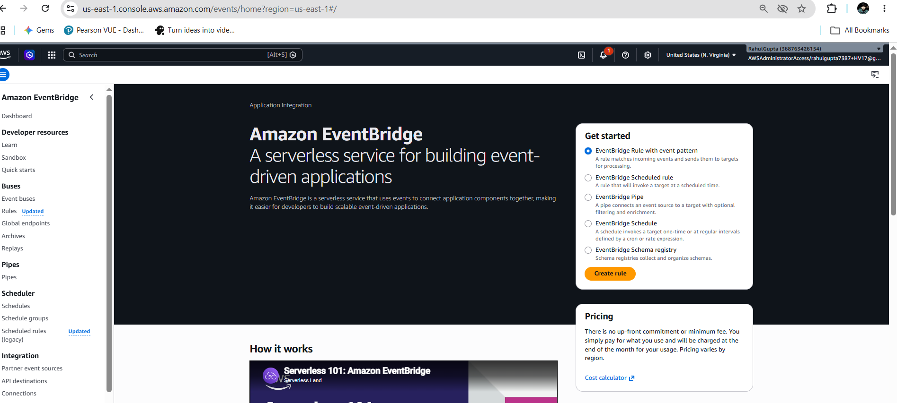

Configure the rule:
- Name: `weekly-ebs-backup`
- Description: Triggers EBS snapshot Lambda every Sunday at 2AM UTC
- Schedule pattern: Cron expression: `0 2 ? * SUN *`

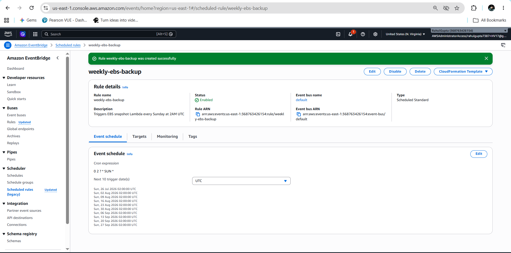

### Discussion

> **AWS Data Lifecycle Manager (DLM)** handles automated EBS snapshots natively and is the managed solution for simple retention policies. Lambda is still the better choice when you need custom retention logic (e.g., keep daily snapshots for 7 days, weekly for 30, monthly for a year), when you need to copy snapshots cross-account or cross-region for DR, when you want custom notifications (Slack/Teams) on backup events, or when backup creation needs to be coordinated with application-level operations like flushing database buffers before the snapshot.

---

## Assignment 3: Auto-Tagging EC2 Instances on Launch

**Objective:** Automatically tag newly launched EC2 instances for resource tracking, ownership, and cost allocation.

### Architecture Diagram

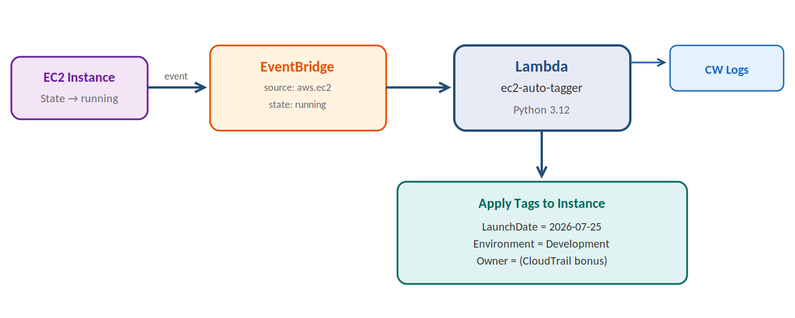

### Phase 1: Create the IAM Role

**Step 1.1 — Create the role**

IAM → Roles → Create role → AWS service → Lambda → Role name: `lambda-ec2-autotag-role`

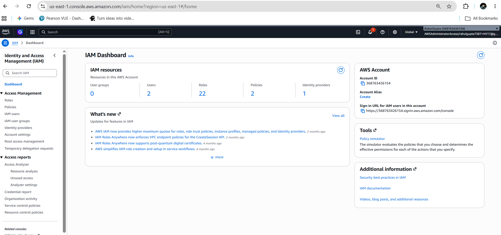
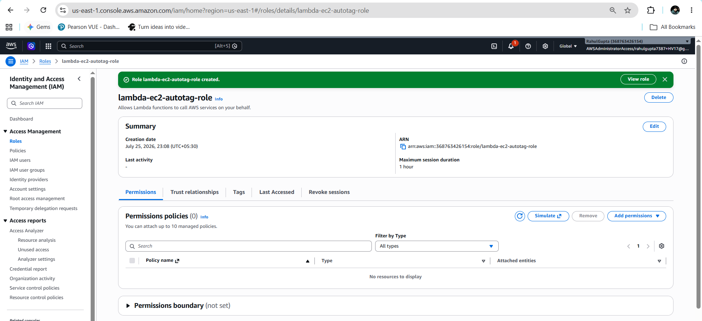

**Step 1.2 — Add inline policy**

Policy name: `ec2-autotag-policy`

```json
{
  "Version": "2012-10-17",
  "Statement": [
    {
      "Sid": "EC2TaggingAccess",
      "Effect": "Allow",
      "Action": [
        "ec2:CreateTags",
        "ec2:DescribeInstances"
      ],
      "Resource": "*"
    },
    {
      "Sid": "CloudWatchLogs",
      "Effect": "Allow",
      "Action": [
        "logs:CreateLogGroup",
        "logs:CreateLogStream",
        "logs:PutLogEvents"
      ],
      "Resource": "arn:aws:logs:*:*:*"
    }
  ]
}
```

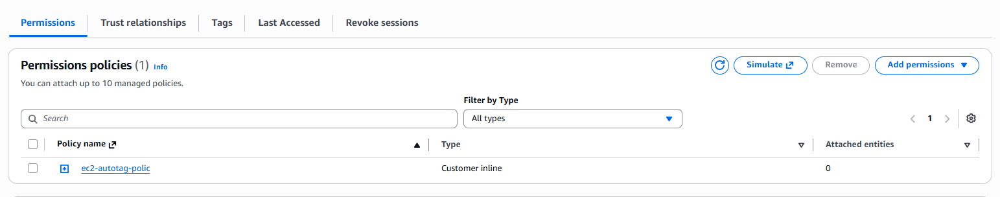

### Phase 2: Create the Lambda Function

Lambda → Create function
- Function name: `ec2-auto-tagger`
- Runtime: Python 3.14
- Execution role: `lambda-ec2-autotag-role`

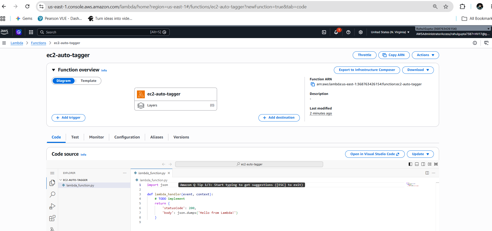

Paste the code from [`assignment-3/lambda_function.py`](assignment-3/lambda_function.py).

**Add environment variable:**

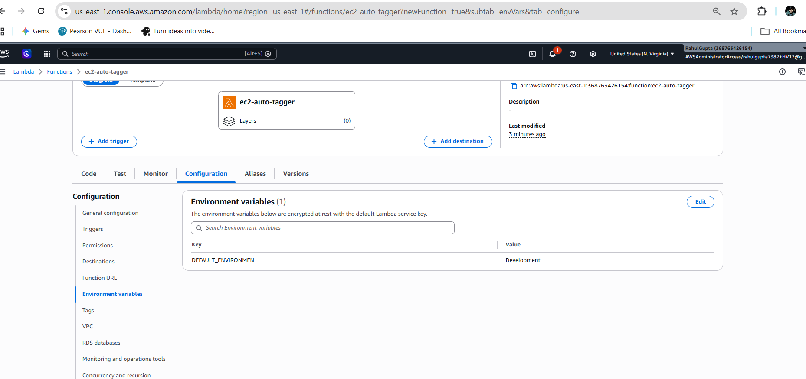

**Set timeout:**

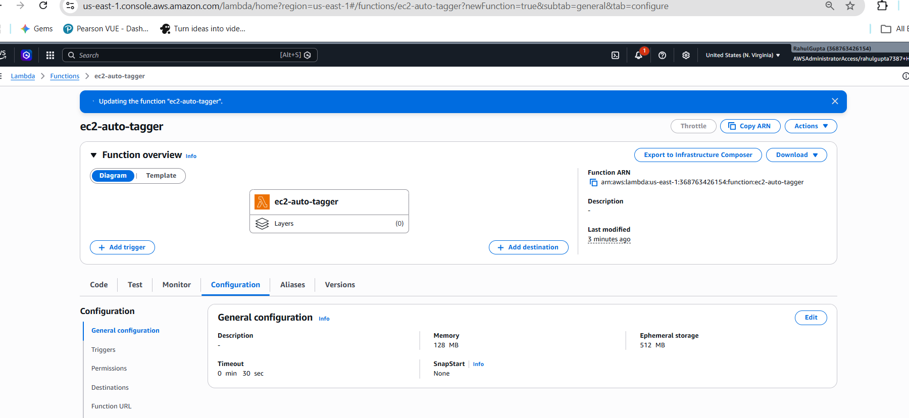

### Phase 3: Create the EventBridge Rule (Event Pattern)

EventBridge → Create rule → Rule type: **Rule with an event pattern**

Event pattern:
```json
{
  "source": ["aws.ec2"],
  "detail-type": ["EC2 Instance State-change Notification"],
  "detail": {
    "state": ["running"]
  }
}
```

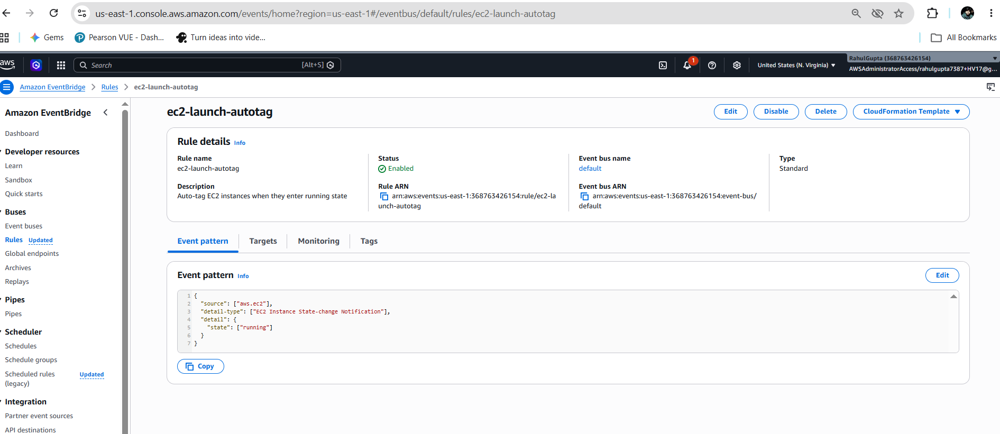

### Phase 4: Real Test — Launch an EC2 Instance

**Step 4.1 — Launch a t3.micro instance**

EC2 → Instances → Launch instances
- Name: `autotag-test`
- AMI: Amazon Linux 2023 (free tier eligible)
- Instance type: t3.micro
- Key pair: Proceed without a key pair

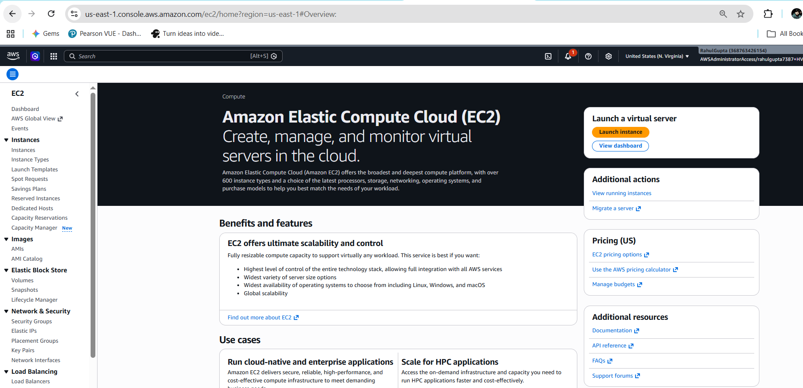
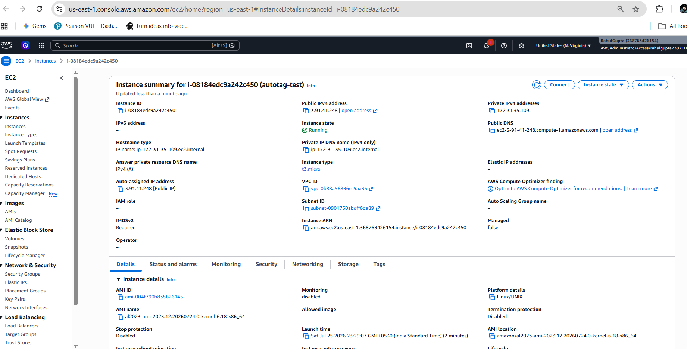
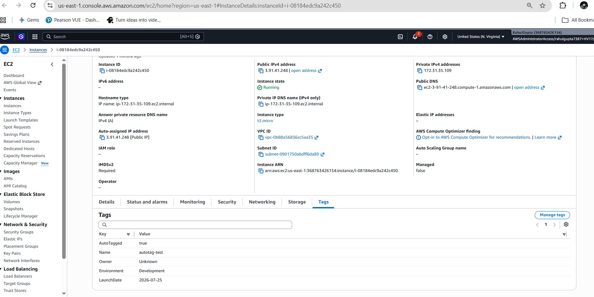

**Step 4.2 — Check CloudWatch Logs**

CloudWatch → Log groups → `/aws/lambda/ec2-auto-tagger`

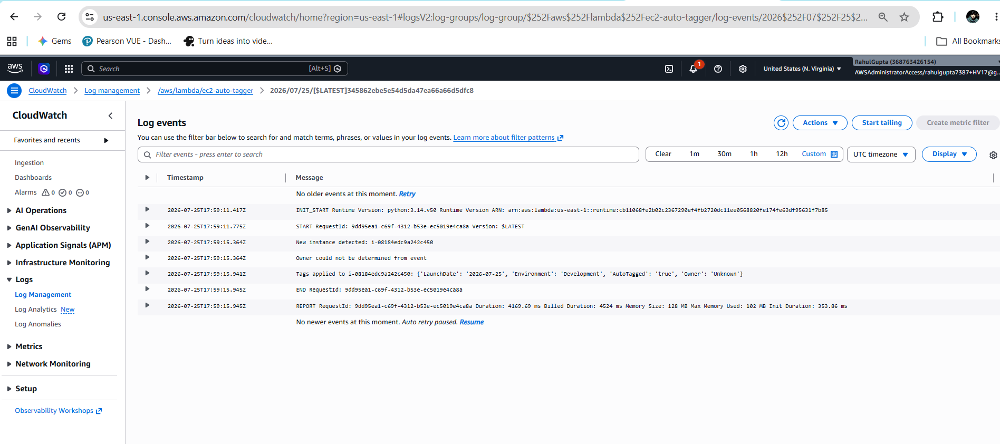
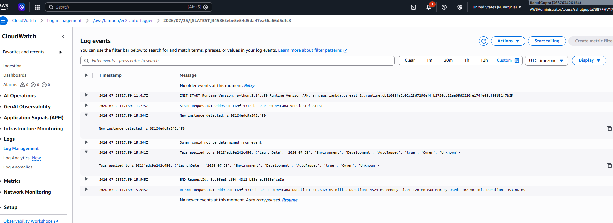

**Step 4.3 — TERMINATE the instance**

EC2 → Instances → Select `autotag-test` → Instance state → **Terminate instance**

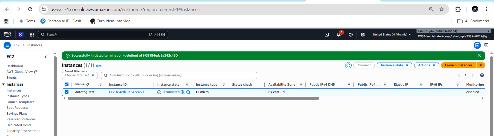

### Discussion

> The bonus **Owner tag** extraction works by reading the `userIdentity` field from CloudTrail events. The standard EC2 state-change notification doesn't include this field, but a separate EventBridge rule matching the CloudTrail `RunInstances` API call does. In production, you'd create a second rule with event pattern `source: aws.ec2`, `detail-type: AWS API Call via CloudTrail`, `detail.eventName: RunInstances` to capture the IAM principal who launched the instance. This is a popular interview scenario because it demonstrates event-driven security and cost-allocation automation.

---

## Assignment 4: Daily AWS Cost Alert Using Cost Explorer API and SNS

**Objective:** Build an automated alert when AWS spend exceeds a threshold using the Cost Explorer API (the modern, interview-relevant approach — not the legacy CloudWatch Billing metric).

### Architecture Diagram

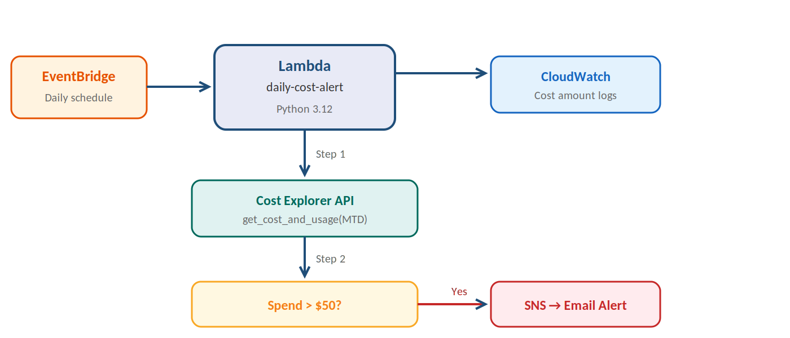

### Phase 1: Create the SNS Topic and Email Subscription

**Step 1.1 — Open SNS**

AWS Console → search SNS → click Simple Notification Service

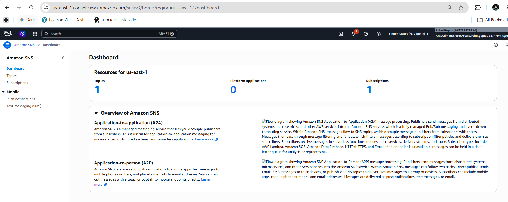

**Step 1.2 — Create a topic**

Topics → Create topic → Type: Standard → Name: `CostAlerts`

Topic ARN: `arn:aws:sns:us-east-1:368763426154:CostAlerts`

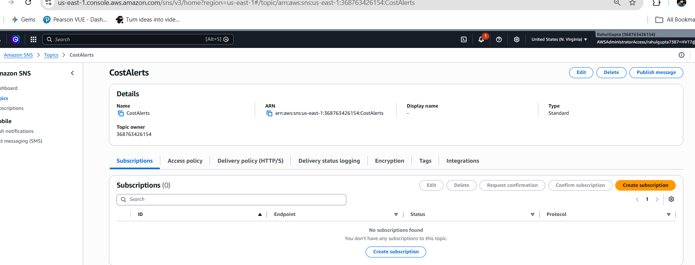

**Step 1.3 — Subscribe your email**

Create subscription → Protocol: Email → Endpoint: your email address

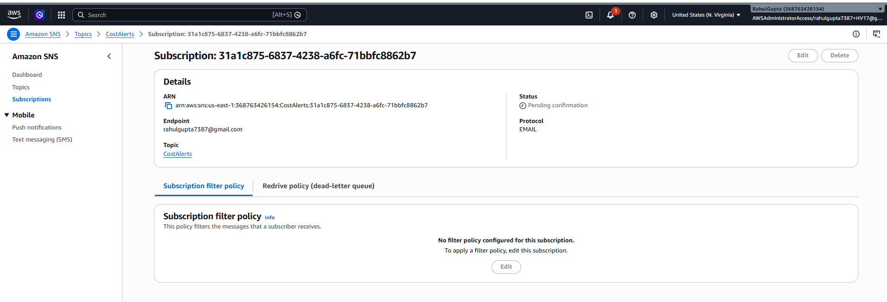

**Step 1.4 — Confirm the subscription**

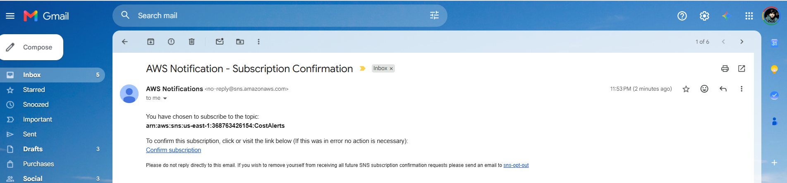

### Phase 2: Create the IAM Role

**Step 2.1 — Create the role**

IAM → Roles → Create role → AWS service → Lambda → Role name: `lambda-cost-alert-role`

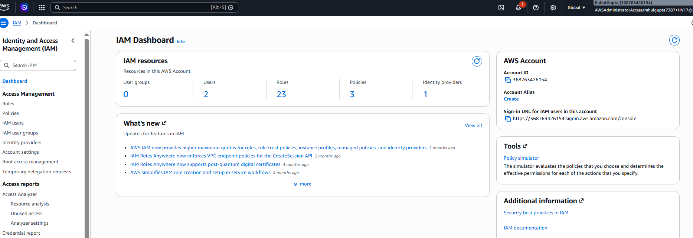
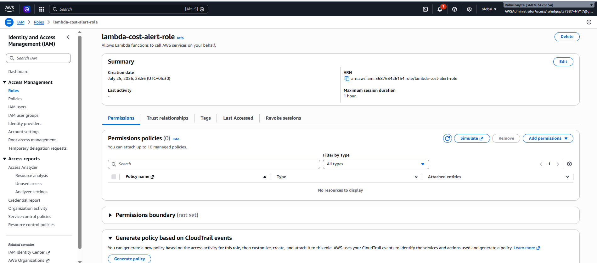

**Step 2.2 — Add inline policy**

```json
{
  "Version": "2012-10-17",
  "Statement": [
    {
      "Sid": "CostExplorerRead",
      "Effect": "Allow",
      "Action": ["ce:GetCostAndUsage"],
      "Resource": "*"
    },
    {
      "Sid": "SNSPublish",
      "Effect": "Allow",
      "Action": ["sns:Publish"],
      "Resource": "arn:aws:sns:us-east-1:368763426154:CostAlerts"
    },
    {
      "Sid": "CloudWatchLogs",
      "Effect": "Allow",
      "Action": [
        "logs:CreateLogGroup",
        "logs:CreateLogStream",
        "logs:PutLogEvents"
      ],
      "Resource": "arn:aws:logs:*:*:*"
    }
  ]
}
```

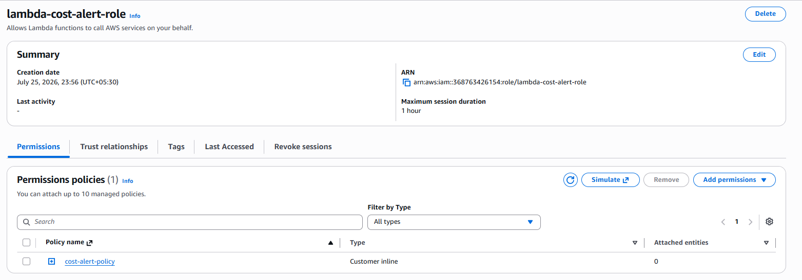

### Phase 3: Create the Lambda Function

Lambda → Create function
- Function name: `daily-cost-alert`
- Runtime: Python 3.14
- Execution role: `lambda-cost-alert-role`

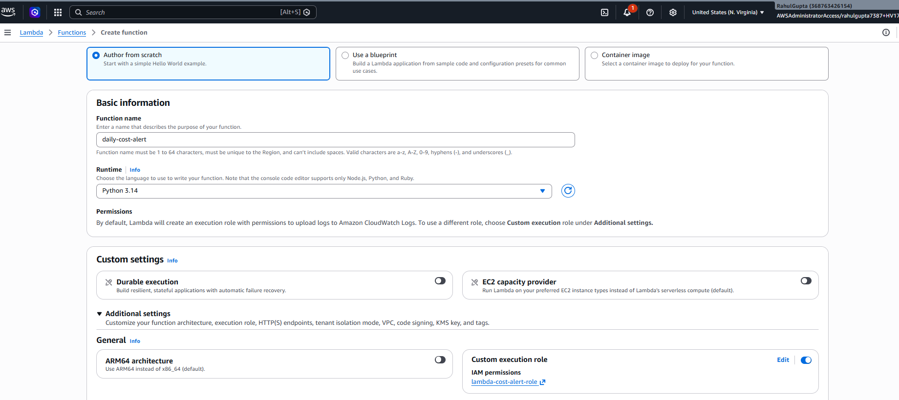
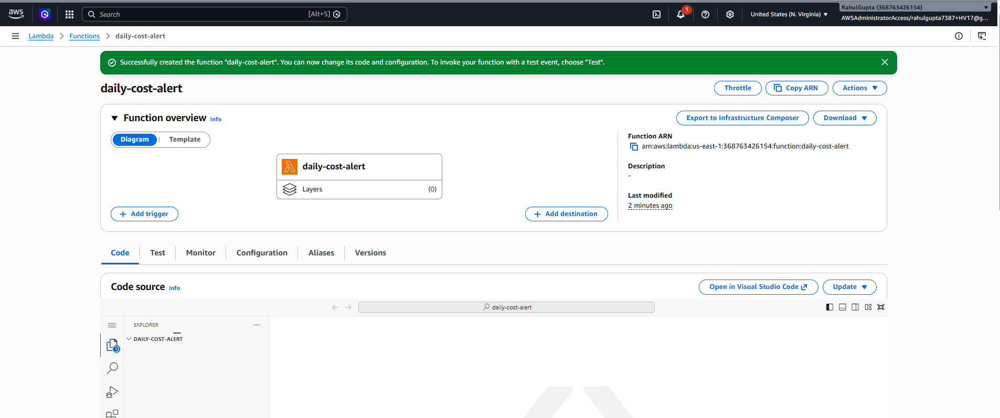

Paste the code from [`assignment-4/lambda_function.py`](assignment-4/lambda_function.py).

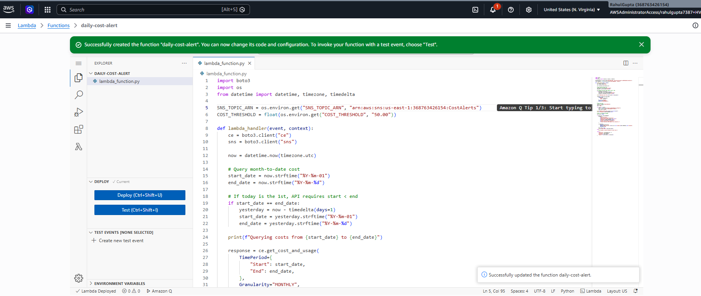

**Add environment variables:**
| Key | Value |
|-----|-------|
| `SNS_TOPIC_ARN` | `arn:aws:sns:us-east-1:368763426154:CostAlerts` |
| `COST_THRESHOLD` | `0.01` (for testing) |

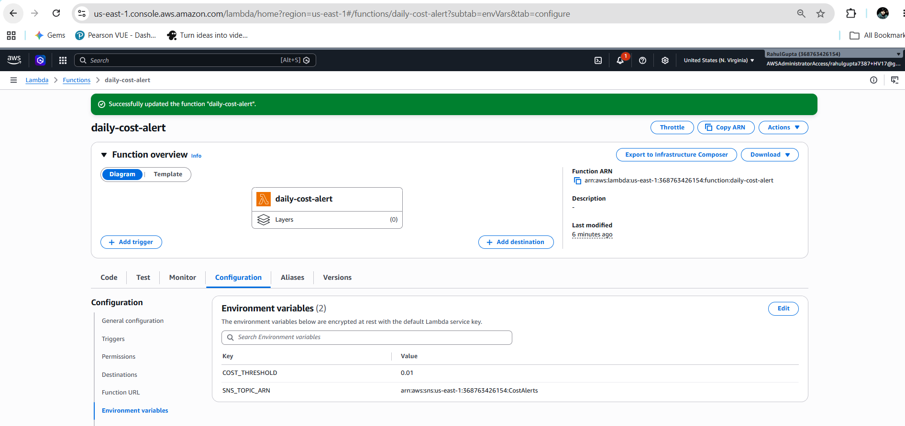
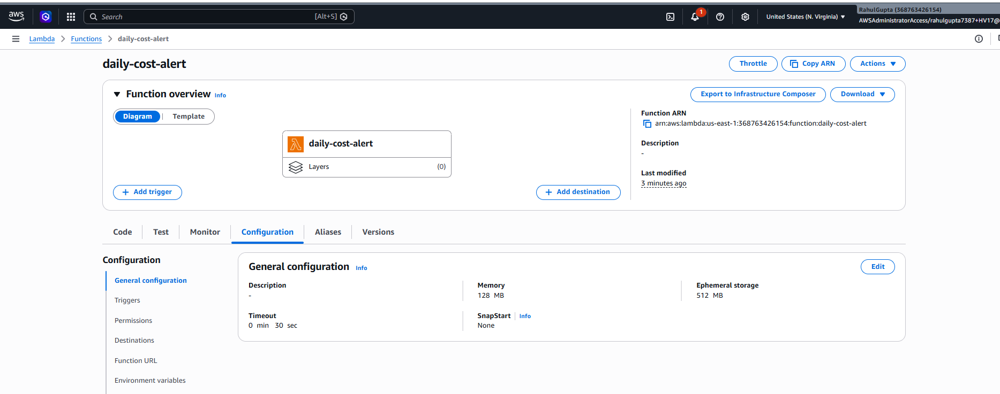

### Phase 4: Test the Function

#### Debugging: SNS Authorization Error

First test run encountered an `AuthorizationError`:

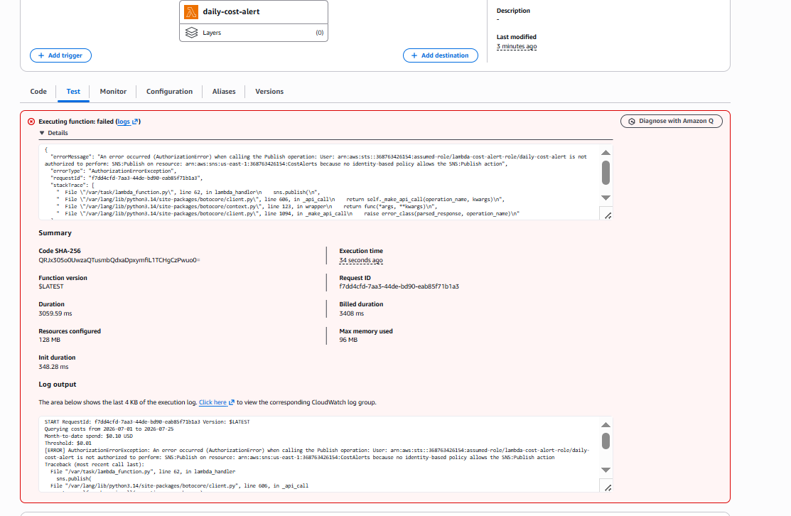

**Root cause:** The IAM policy had a trailing space in the SNS topic ARN:
```
"arn:aws:sns:us-east-1:368763426154:CostAlerts "   ← invisible trailing space
```

AWS treats ARNs as **exact strings**. The policy granted permission to a topic called `CostAlerts ` (with space), but Lambda was publishing to `CostAlerts` (without space). They didn't match → `AuthorizationError`.

**Fix:** Remove the trailing space so the ARN matches exactly.

> **Key takeaway:** IAM policy evaluation is character-exact on resource ARNs. A single extra space, typo, or wrong account ID will result in an AuthorizationError even though the policy looks correct at a glance. Always double-check ARNs for trailing whitespace and correct account IDs.

#### Successful Execution

After fixing the ARN:

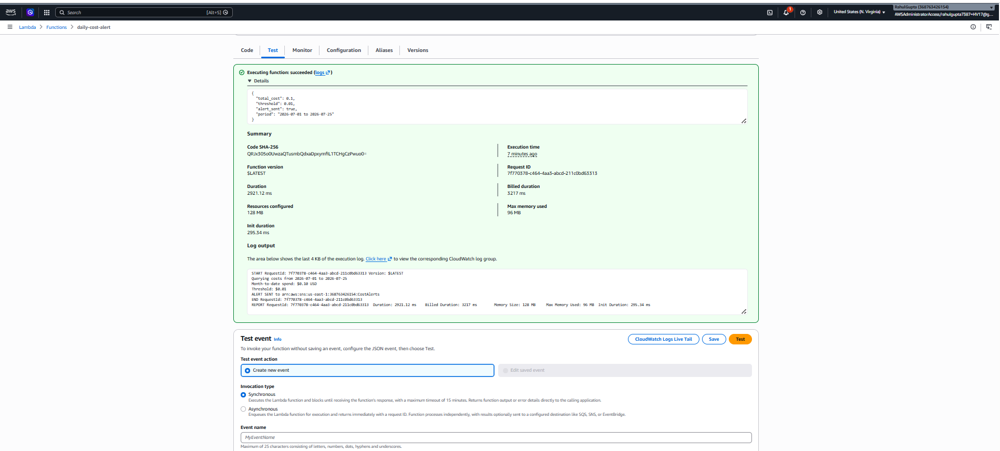

```json
{
  "total_cost": 0.1,
  "threshold": 0.01,
  "alert_sent": true,
  "period": "2026-07-01 to 2026-07-25"
}
```

**Check CloudWatch Logs:**

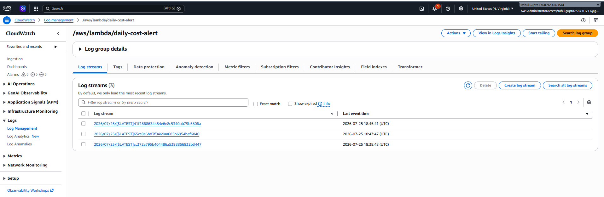
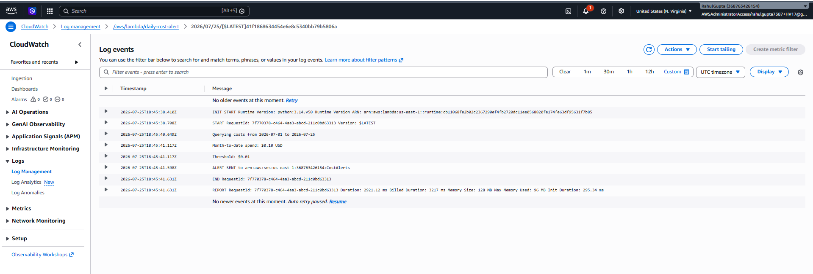

**Set production threshold** — Change `COST_THRESHOLD` to `50`:

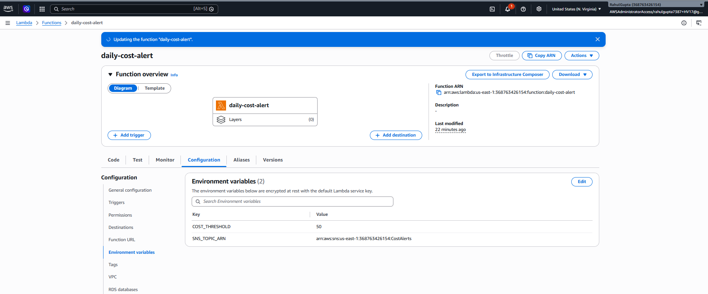

### Phase 5: Create the EventBridge Daily Schedule

Amazon EventBridge → Schedules → Create schedule

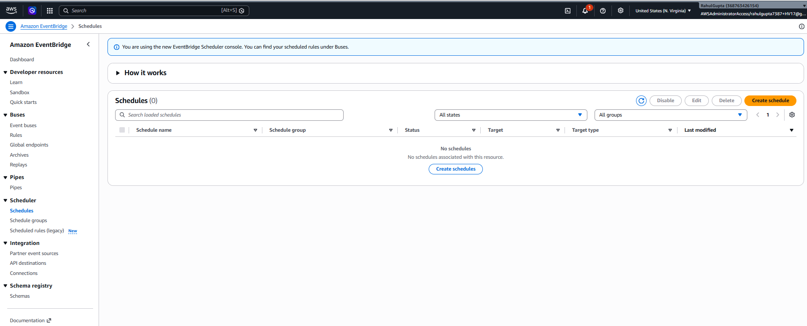

- Name: `daily-cost-check`
- Description: Daily check of AWS month-to-date spend
- Schedule type: Rate-based schedule → `1 day`
- Target: AWS Lambda → `daily-cost-alert`

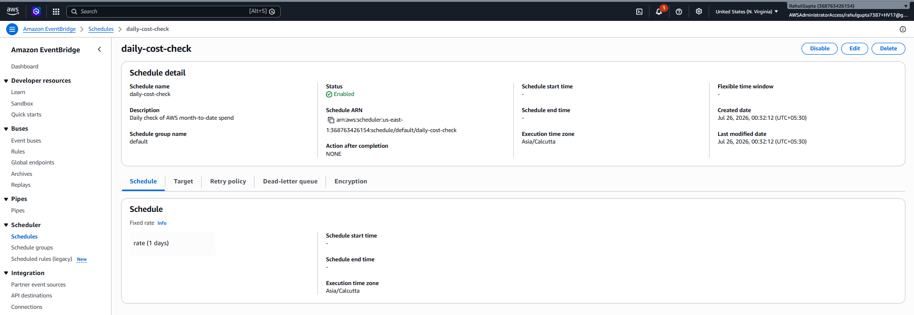

### Discussion

> **AWS Budgets** is the managed alternative — it supports monthly thresholds with email/SNS alerts natively and costs $0.02/day per budget. Custom Lambda logic wins when you need per-service cost breakdowns in the alert (e.g., "EC2 is 80% of spend"), delivery to Slack or Teams via webhooks, anomaly detection logic (e.g., "spend today is 50% higher than the same day last month"), or multi-account consolidated cost monitoring with custom formatting.

---

## Assignment 5: Restore an EC2 Instance from the Latest Snapshot

**Objective:** Automate disaster-recovery — rebuild an instance from its most recent EBS snapshot.

**Prerequisite:** At least one snapshot of the source instance's root volume exists (Assignment 2 pairs well here).

### Architecture Diagram

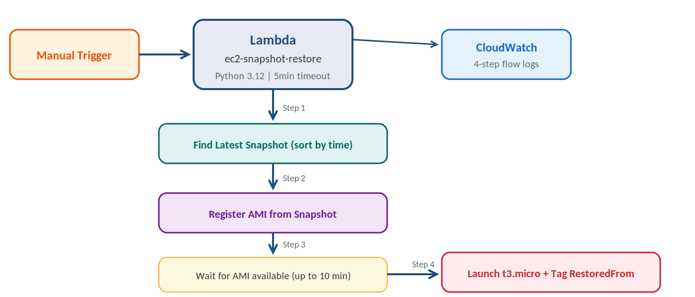

### Phase 1: Create the IAM Role

**Step 1.1 — Create the role**

- Go to IAM → Roles → Create role
- Trusted entity: AWS service → Lambda
- Click Next → skip managed policies → Next
- Role name: `lambda-ec2-restore-role`

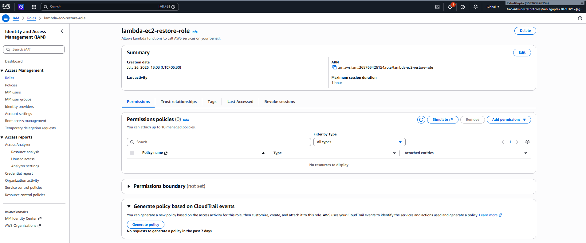

**Step 1.2 — Add inline policy**

Click into `lambda-ec2-restore-role` → Permissions tab → Add permissions → Create inline policy → JSON tab:

```json
{
  "Version": "2012-10-17",
  "Statement": [
    {
      "Sid": "SnapshotAndAMIAccess",
      "Effect": "Allow",
      "Action": [
        "ec2:DescribeSnapshots",
        "ec2:RegisterImage",
        "ec2:DescribeImages",
        "ec2:RunInstances",
        "ec2:CreateTags"
      ],
      "Resource": "*"
    },
    {
      "Sid": "CloudWatchLogs",
      "Effect": "Allow",
      "Action": [
        "logs:CreateLogGroup",
        "logs:CreateLogStream",
        "logs:PutLogEvents"
      ],
      "Resource": "arn:aws:logs:*:*:*"
    }
  ]
}
```

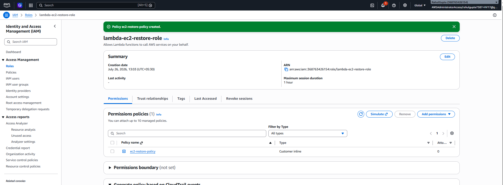

### Phase 2: Create the Lambda Function

- Go to Lambda → Create function
- Author from scratch
- Function name: `ec2-snapshot-restore`
- Runtime: Python 3.14
- Execution role: Use an existing role → select `lambda-ec2-restore-role`

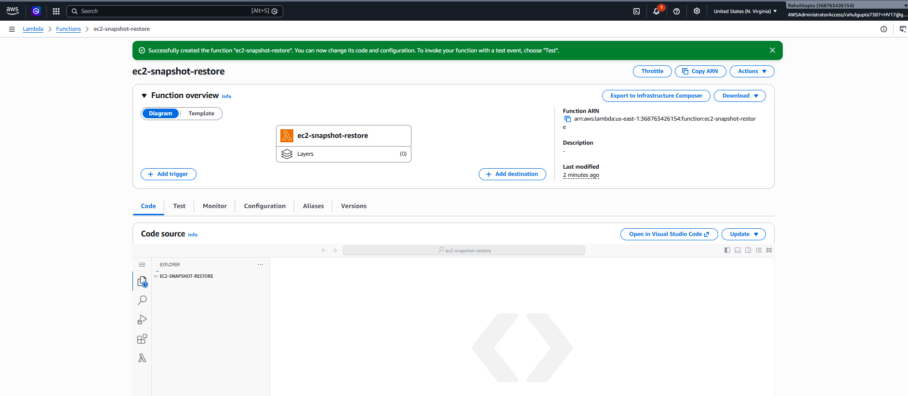
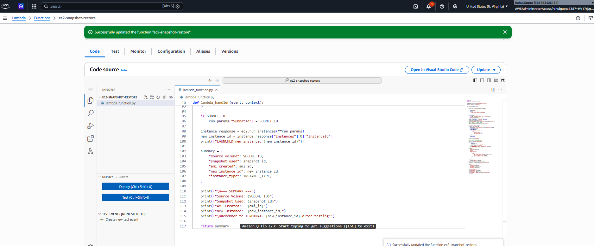

**Step 2.2 — Paste the code**

Paste the code from [`assignment-5/lambda_function.py`](assignment-5/lambda_function.py).

The function performs 4 steps:
1. **Find the most recent snapshot** for the given volume (sort `describe_snapshots` by `StartTime`)
2. **Register an AMI** from the snapshot with `register_image` (specify root device mapping)
3. **Wait for AMI** to become available using a waiter
4. **Launch a new t3.micro instance** from that AMI and tag it (`RestoredFrom=<snapshot-id>`)

**Step 2.3 — Add environment variables**

Configuration → Environment variables → Edit:

| Key | Value | Description |
|-----|-------|-------------|
| `VOLUME_ID` | `vol-0b28c036a11912ffc` | Source EBS volume |
| `INSTANCE_TYPE` | `t3.micro` | Instance type to launch |
| `SUBNET_ID` | *(leave empty)* | Optional subnet for the instance |
| `ARCHITECTURE` | `x86_64` | AMI architecture |

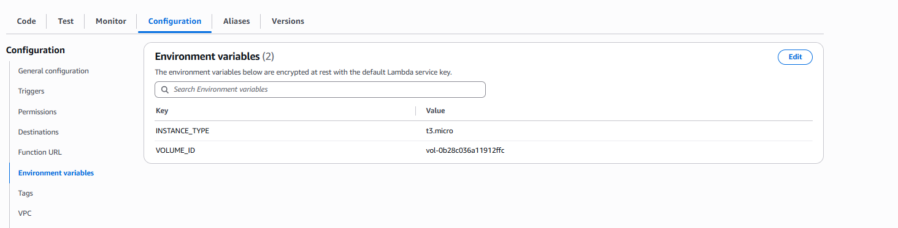

**Step 2.4 — Increase timeout**

Configuration → General configuration → Edit → Timeout: **5 min 0 sec** (AMI registration needs time)

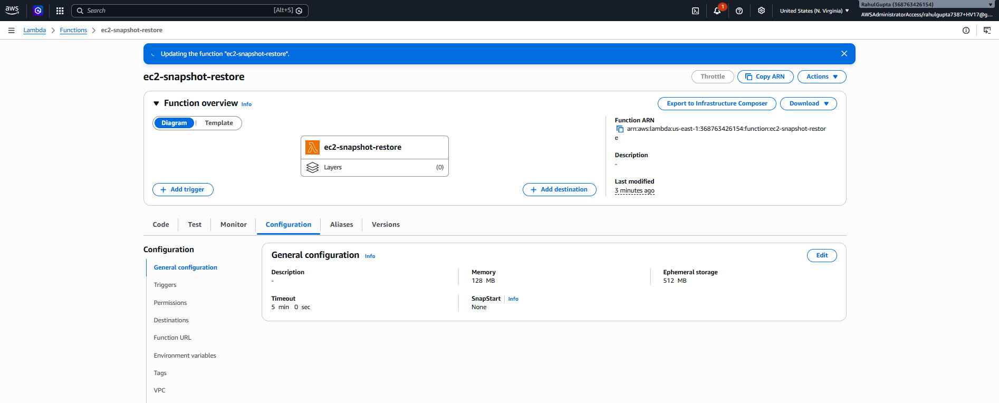

### Phase 3: Test the Function & Troubleshooting

**Step 3.1 — Create test event and run**

Go to Test tab → Event name: `TestRestore` → Event JSON: `{}` → Click **Test**

#### Debugging: No Snapshots Found

The function ran correctly but returned an error — no completed snapshots found for the volume. The original volume from Assignment 2 was deleted during cleanup.

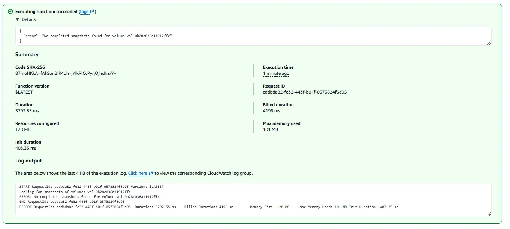

**Fix:** Create a new volume and snapshot:
- Go to EC2 → Elastic Block Store → Snapshots → **Create snapshot**
- New Volume ID: `vol-0fe7735758dd44059`
- Snapshot ID: `snap-09d79f3b09ccfab65`

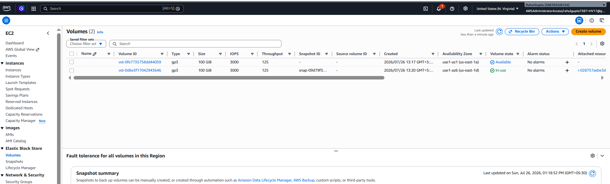
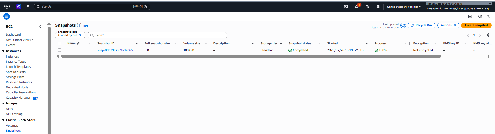

#### Successful Retest

After creating the snapshot, retest succeeded:

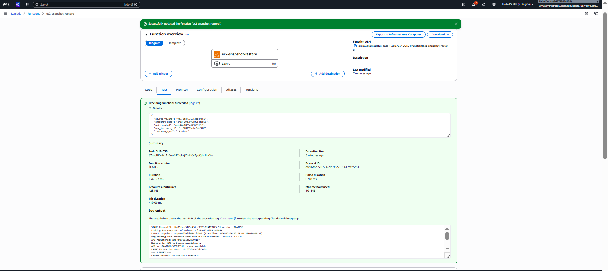

**Step 3.4 — Check CloudWatch Logs**

Go to CloudWatch → Log groups → `/aws/lambda/ec2-snapshot-restore` → Click the latest log stream

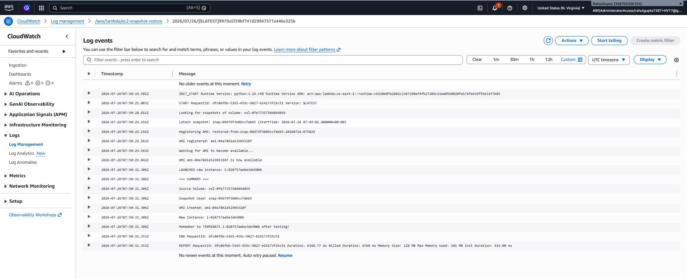
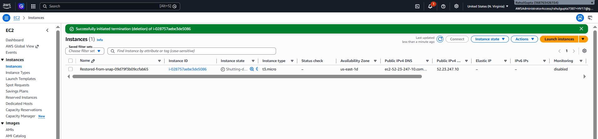

> **Important:** Remember to **TERMINATE** the restored instance after testing to avoid charges! Go to EC2 → Instances → select the restored instance → Instance state → Terminate instance.

### Discussion

> For simple disaster recovery, **AWS Backup** or manually maintained AMIs can handle instance restoration natively. Lambda-based restore automation is the better choice when you need to implement custom recovery logic (e.g., selecting snapshots based on tags, application version, or environment), when restoration must be triggered programmatically as part of a larger incident-response workflow, when you need cross-region or cross-account restoration with custom networking and security group configurations, or when the recovery process requires coordination with other services like updating DNS records in Route 53, re-registering with a load balancer, or notifying teams via Slack/SNS upon successful restoration.

---

## Assignment 6: Audit S3 Buckets for Public Access and Notify

**Objective:** Detect any bucket that is publicly accessible and alert via SNS.

**Note:** Since April 2023, new buckets have Block Public Access enabled and ACLs disabled by default — so the audit must check both the Block Public Access configuration and bucket policy status, not just ACLs.

### Architecture Diagram

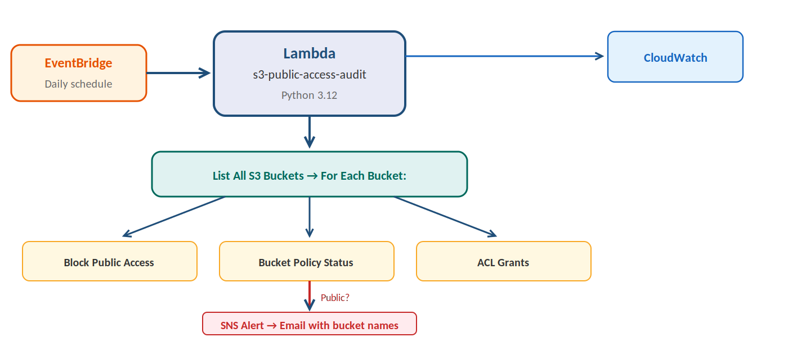

### Phase 1: Create the SNS Topic

**Step 1.1 — Create topic**

- Go to SNS → Topics → Create topic
- Type: Standard
- Name: `S3PublicAlerts`
- Click Create topic
- Copy the Topic ARN: `arn:aws:sns:us-east-1:368763426154:S3PublicAlerts`

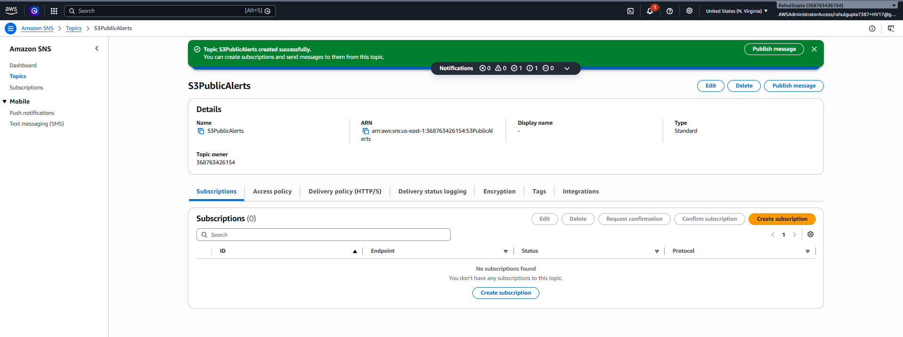
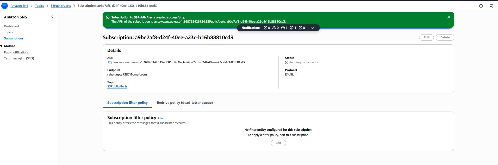

**Step 1.2 — Subscribe your email**

- On the topic page → Create subscription
- Protocol: Email
- Endpoint: your email address
- Click Create subscription
- Confirm the subscription from your email inbox

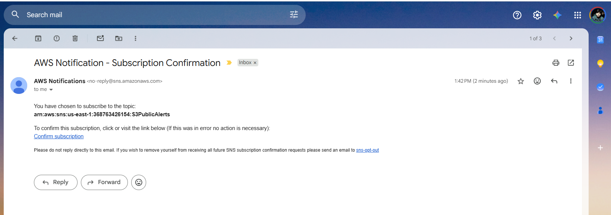
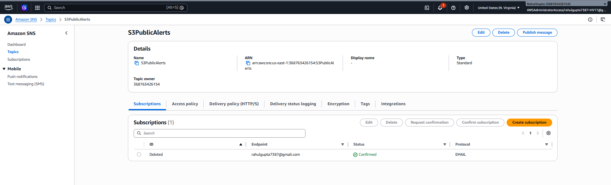

### Phase 2: Create the IAM Role

**Step 2.1 — Create the role**

- Go to IAM → Roles → Create role
- Trusted entity: AWS service → Lambda
- Click Next → skip managed policies → Next
- Role name: `lambda-s3-audit-role`

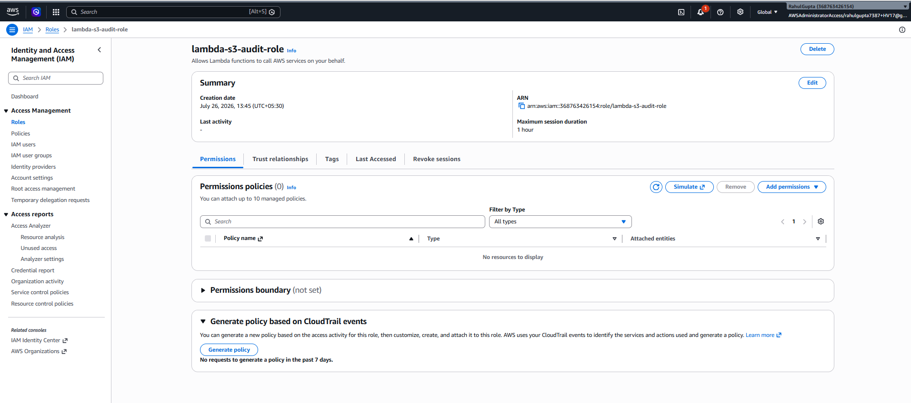

**Step 2.2 — Add inline policy**

Permissions tab → Add permissions → Create inline policy → JSON tab:

```json
{
  "Version": "2012-10-17",
  "Statement": [
    {
      "Sid": "S3AuditRead",
      "Effect": "Allow",
      "Action": [
        "s3:ListAllMyBuckets",
        "s3:GetBucketPublicAccessBlock",
        "s3:GetBucketPolicyStatus",
        "s3:GetBucketAcl"
      ],
      "Resource": "*"
    },
    {
      "Sid": "SNSPublish",
      "Effect": "Allow",
      "Action": [
        "sns:Publish"
      ],
      "Resource": "arn:aws:sns:us-east-1:368763426154:S3PublicAlerts"
    },
    {
      "Sid": "CloudWatchLogs",
      "Effect": "Allow",
      "Action": [
        "logs:CreateLogGroup",
        "logs:CreateLogStream",
        "logs:PutLogEvents"
      ],
      "Resource": "arn:aws:logs:*:*:*"
    }
  ]
}
```

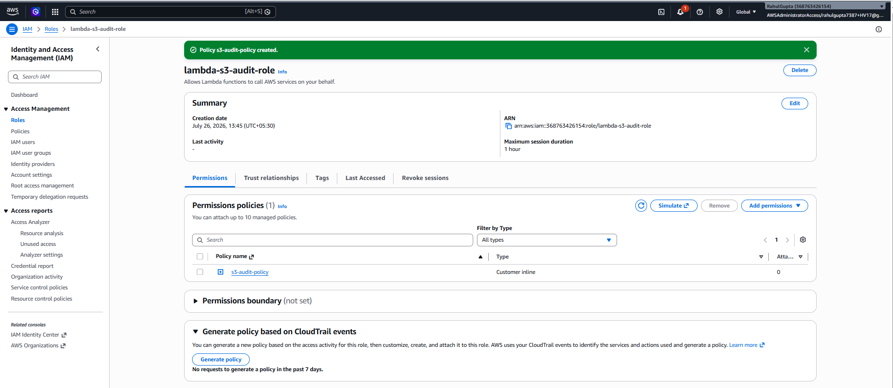

### Phase 3: Create the Lambda Function

**Step 3.1 — Create function**

- Go to Lambda → Create function
- Author from scratch
- Function name: `s3-public-access-audit`
- Runtime: Python 3.12
- Execution role: Use an existing role → select `lambda-s3-audit-role`

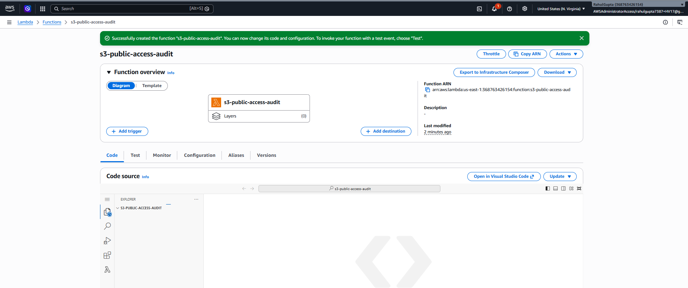

**Step 3.2 — Paste the code**

Paste the code from [`assignment-6/lambda_function.py`](assignment-6/lambda_function.py).

The function performs 3 checks on every bucket:
1. **Block Public Access** configuration — are all 4 settings enabled?
2. **Bucket Policy Status** — does the policy allow public access?
3. **ACL Grants** — are there AllUsers or AuthenticatedUsers grants?

**Step 3.3 — Add environment variable**

Configuration → Environment variables → Edit:

| Key | Value |
|-----|-------|
| `SNS_TOPIC_ARN` | `arn:aws:sns:us-east-1:368763426154:S3PublicAlerts` |

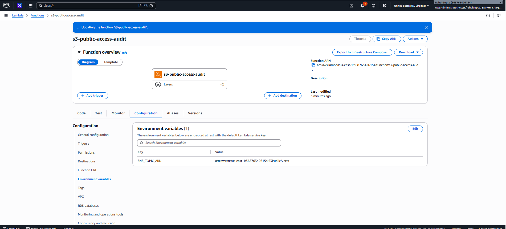

**Step 3.4 — Set timeout**

Configuration → General configuration → Edit → Timeout: **2 min 0 sec**

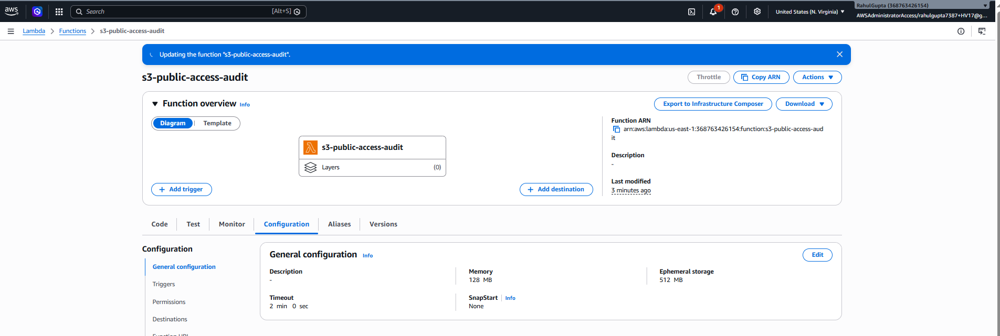

### Phase 4: Create a Deliberately Public Test Bucket

**Step 4.1 — Create the test bucket**

- Go to S3 → Create bucket
- Name: `test-public-audit-rahul`
- Region: us-east-1
- **Uncheck** "Block all public access" checkbox
- **Check** the acknowledgement box that appears
- Click Create bucket

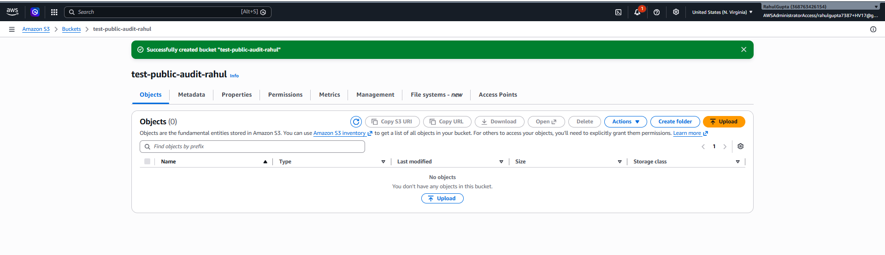

**Step 4.2 — Add a public bucket policy**

Go to the bucket → Permissions tab → Bucket policy → Edit → paste a public-read policy to make the bucket detectable by the audit.

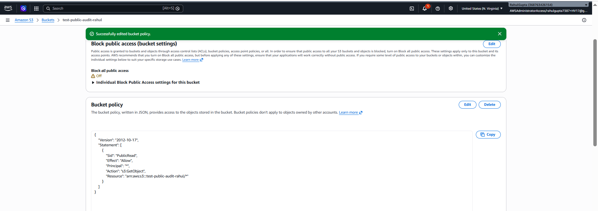

### Phase 5: Test the Function

**Step 5.1 — Run the test**

Go to Lambda → `s3-public-access-audit` → Test tab → Event JSON: `{}` → Click **Test**

The function should:
- List all buckets in the account
- Flag `test-public-audit-rahul` as public (Block Public Access disabled + public policy)
- Send an SNS alert email with the findings
- Return a summary showing 1 public bucket found

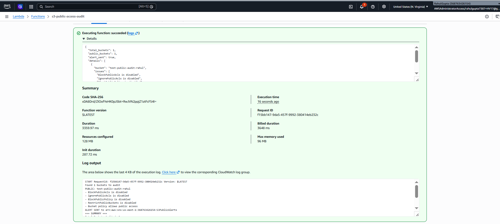
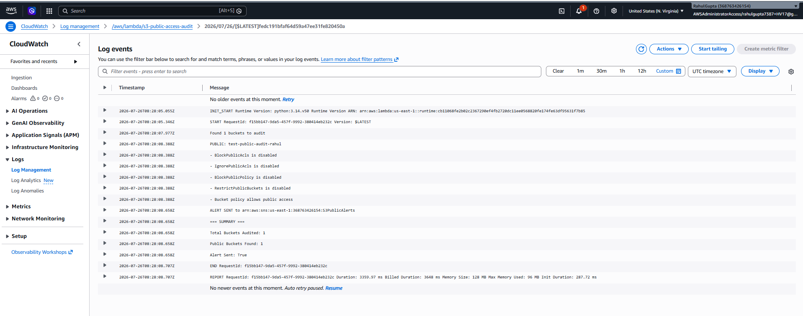

### Phase 6: RE-SECURE the Test Bucket

**This step is critical — do not leave a public bucket in your account!**

- Go to S3 → `test-public-audit-rahul` → Permissions → Bucket policy → **Delete**
- Enable Block Public Access: Permissions → Block public access → **Edit** → check all boxes → Save
- Alternatively, just delete the test bucket entirely: empty it first, then delete

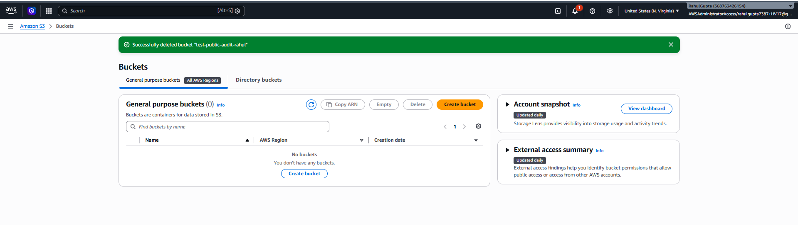

### Phase 7: Create the EventBridge Daily Schedule

**Step 7.1 — Create schedule**

- Go to Amazon EventBridge → Schedules → Create schedule
- Name: `daily-s3-audit`
- Description: Daily S3 public access audit
- Schedule pattern: Recurring schedule
- Schedule type: Rate-based schedule
- Rate expression: `1 day`
- Target: AWS Lambda → `s3-public-access-audit`

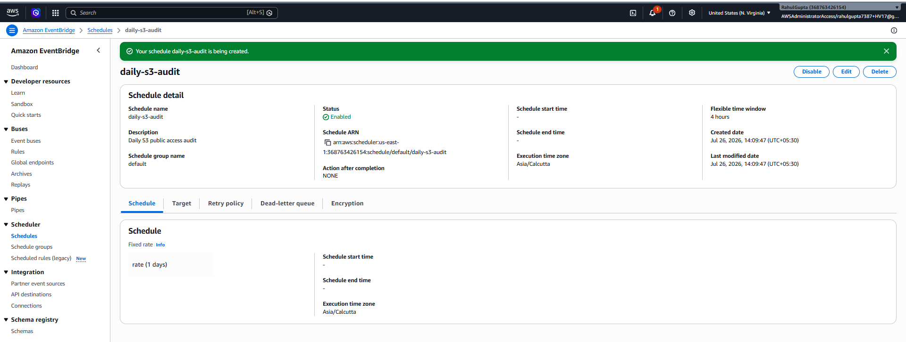

### Discussion

> AWS provides native tools like **S3 Access Analyzer** and **IAM Access Analyzer** that can detect public S3 buckets and flag overly permissive policies. For simple alerting, **AWS Config** rules (e.g., `s3-bucket-public-read-prohibited`) can monitor and auto-remediate public access. Lambda-based auditing is the better choice when you need custom audit logic across multiple checks (Block Public Access, bucket policy, and ACLs combined), when you want consolidated alerts with detailed per-bucket issue breakdowns in a single notification, when alerts need to be delivered to Slack, Teams, or PagerDuty rather than just email, or when you need to integrate the audit with a broader compliance dashboard that correlates S3 exposure with other security findings across your AWS environment.

---

## Summary of All Assignments

| # | Assignment | Lambda Function | IAM Role | Trigger |
|---|-----------|----------------|----------|---------|
| 1 | S3 Bucket Cleanup | `s3-bucket-cleanup` | `lambda-s3-cleanup-role` | Manual |
| 2 | EBS Snapshot Mgmt | `ebs-snapshot-manager` | `lambda-ebs-backup-role` | Weekly cron |
| 3 | EC2 Auto-Tagging | `ec2-auto-tagger` | `lambda-ec2-autotag-role` | Event pattern |
| 4 | Cost Alert (SNS) | `daily-cost-alert` | `lambda-cost-alert-role` | Daily rate |
| 5 | EC2 Restore | `ec2-snapshot-restore` | `lambda-ec2-restore-role` | Manual |
| 6 | S3 Public Audit | `s3-public-access-audit` | `lambda-s3-audit-role` | Daily rate |

---

## Common Setup

All Lambda functions share the same trust policy ([`lambda_trust_policy.json`](lambda_trust_policy.json)):

```json
{
  "Version": "2012-10-17",
  "Statement": [
    {
      "Effect": "Allow",
      "Principal": {
        "Service": "lambda.amazonaws.com"
      },
      "Action": "sts:AssumeRole"
    }
  ]
}
```

### General Steps for Each Assignment

1. **Create an IAM role** using the trust policy above
2. **Attach the inline policy** from the assignment's `iam_policy.json`
3. **Create the Lambda function** (Python 3.12+ runtime) with the assignment's execution role
4. **Configure environment variables** as specified
5. **Set timeout** to at least 1 minute
6. **Test** manually, then set up EventBridge triggers as needed

---

## Cleanup Checklist

All resources cleaned up after testing:
- EC2 instances terminated
- EBS volumes/snapshots deleted
- AMIs deregistered
- S3 buckets emptied and deleted
- Lambda functions deleted
- IAM roles removed
- EventBridge rules deleted
- SNS topics removed
- CloudWatch log groups deleted
